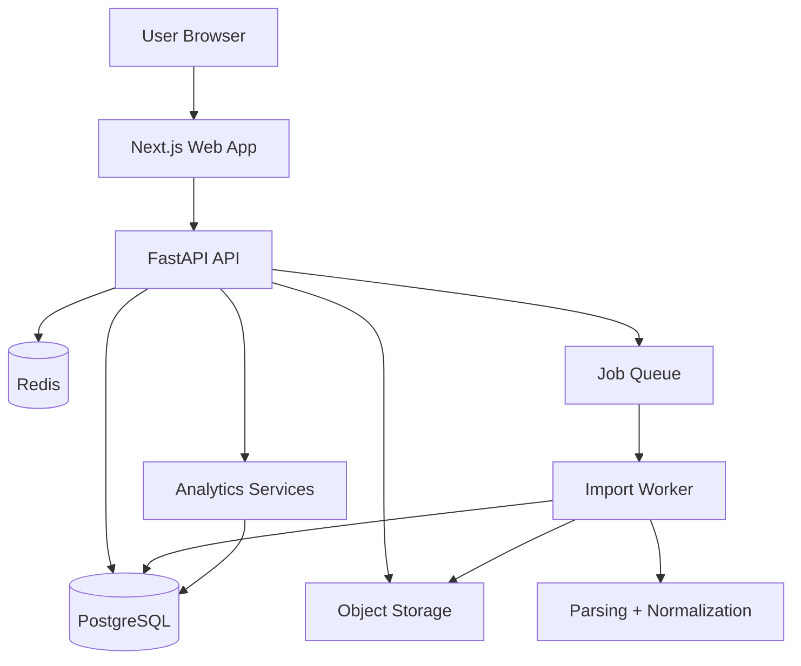

# Full App Migration Architecture

## Status
Proposed

## Goal

Migrate the finance tracker from a local-first CLI plus static dashboard into a full multi-user web application that other people can use reliably.

The target product is:

- authenticated
- multi-tenant
- database-backed
- queue-driven for imports
- deployable as a real web app

This document defines the V1 architecture, the recommended stack, the initial schema, the API surface, and the migration order from the current codebase.

## Why The Current Architecture Must Change

The current project is designed for:

- a single local user
- flat-file storage
- no concurrent writes
- static HTML dashboard generation
- no authentication
- no tenant isolation

That architecture is correct for a personal offline tool, but it is the wrong foundation for a shared product.

To support external users, the system needs:

- per-user data isolation
- server-side persistence
- secure file uploads
- asynchronous ingestion
- import status tracking
- proper authentication
- deployable frontend and backend services
- a durable data model that supports product features over time

## Architectural Direction

Build the product as a modular monolith, not as microservices.

Recommended shape:

- `apps/web`: Next.js frontend
- `apps/api`: FastAPI backend
- `apps/worker`: queue worker for imports and background processing
- PostgreSQL: primary relational datastore
- Redis: queue and short-lived caching
- object storage: uploaded statements and import artifacts

This preserves product velocity and operational simplicity while giving enough separation to scale the system cleanly.

## Top-Level Architecture



## Core Product Principles

1. Keep Python for backend business logic, analytics, and import parsing.
2. Replace flat files with PostgreSQL as the source of truth.
3. Make imports event-driven and queued immediately, not cron-driven.
4. Keep the backend as a modular monolith until scale forces extraction.
5. Treat uploaded files, normalized transactions, and import metadata as separate concerns.
6. Persist user preferences, including theme, on the server side.

## Recommended Stack

### Frontend

- Next.js
- TypeScript
- React Query or built-in data fetching
- Tailwind or a small design system layer

### Backend

- FastAPI
- Pydantic
- SQLAlchemy 2.x
- Alembic

### Data And Infrastructure

- PostgreSQL
- Redis
- S3-compatible object storage

### Background Jobs

- Celery or RQ

### Auth

Recommended hosted options:

- Clerk
- Auth0
- Supabase Auth

For V1, use a hosted auth provider instead of building auth from scratch.

## ADRs

### ADR-001: Use PostgreSQL Instead Of Flat Files

#### Status
Accepted for target architecture

#### Context

The current system stores `transactions.csv`, `accounts.json`, `goals.json`, and similar local files. This is incompatible with concurrent multi-user access, transactional updates, import tracking, and tenant isolation.

#### Decision

Move all primary application state to PostgreSQL.

#### Alternatives Considered

- Keep flat files as the source of truth
- Use document storage first

#### Consequences

- Positive: transactional integrity, concurrency safety, tenant-aware queries, simpler product evolution
- Negative: migration effort, operational overhead, schema management requirements

### ADR-002: Keep Python For Domain Logic

#### Status
Accepted for target architecture

#### Context

The existing codebase already contains useful Python logic for parsing, analytics, and financial computations. Rewriting that logic in another backend language would create unnecessary churn.

#### Decision

Use FastAPI and keep existing domain logic in Python.

#### Alternatives Considered

- Rewrite backend in Node.js
- Full TypeScript stack

#### Consequences

- Positive: reuse mature code, faster migration, less logic duplication
- Negative: two-language stack once the frontend is added

### ADR-003: Start As A Modular Monolith

#### Status
Accepted for V1

#### Context

The product needs clear modular boundaries but does not yet justify the deployment and coordination overhead of microservices.

#### Decision

Build one backend application with clean internal modules for auth integration, transactions, imports, analytics, goals, and cards.

#### Alternatives Considered

- Immediate microservices split

#### Consequences

- Positive: faster delivery, easier debugging, simpler deployment
- Negative: later extraction may be needed if scale or team size grows significantly

### ADR-004: Use Queue-Backed Immediate Import Processing

#### Status
Accepted for V1

#### Context

Imports are central to the product. They should begin processing as soon as the user uploads a file or connects an account. Cron-based processing would add latency and make the product feel indirect.

#### Decision

All imports create an import record and enqueue a job immediately.

#### Alternatives Considered

- cron-based batch import processing
- synchronous in-request parsing

#### Consequences

- Positive: better UX, safer long-running processing, clear import states
- Negative: requires queue infrastructure and worker process management

## Initial Domain Model

### Users

Represents the application user. Auth may be delegated to a hosted provider, but the app still needs an internal user record.

### User Preferences

Stores persisted UI and locale settings, including:

- theme
- timezone
- currency

### Accounts

Represents checking, savings, credit, or investment accounts owned by a user.

### Transactions

Represents normalized financial activity tied to an account and a user.

### Goals

Represents monthly targets and named savings goals.

### Cards

Represents credit cards and rewards metadata needed by the card analytics layer.

### Imports

Represents the lifecycle of a statement upload or external sync request.

### Import Files

Represents raw files stored in object storage and linked to imports.

## Initial Schema

### `users`

- `id`
- `auth_provider`
- `auth_subject`
- `email`
- `created_at`
- `updated_at`

### `user_preferences`

- `user_id`
- `theme`
- `timezone`
- `currency`
- `created_at`
- `updated_at`

### `accounts`

- `id`
- `user_id`
- `name`
- `type`
- `institution_name`
- `external_account_id`
- `balance`
- `currency`
- `last_synced_at`
- `created_at`
- `updated_at`

### `transactions`

- `id`
- `user_id`
- `account_id`
- `external_id`
- `occurred_on`
- `posted_at`
- `amount`
- `merchant`
- `normalized_merchant`
- `category`
- `is_income`
- `is_savings`
- `source`
- `source_import_id`
- `dedupe_hash`
- `notes`
- `created_at`
- `updated_at`

### `goals`

- `id`
- `user_id`
- `name`
- `goal_type`
- `target_amount`
- `current_amount`
- `deadline`
- `is_monthly`
- `created_at`
- `updated_at`

### `cards`

- `id`
- `user_id`
- `name`
- `network`
- `annual_fee`
- `rewards_config_json`
- `created_at`
- `updated_at`

### `imports`

- `id`
- `user_id`
- `account_id`
- `provider`
- `import_type`
- `status`
- `error_message`
- `started_at`
- `finished_at`
- `created_at`
- `updated_at`

### `import_files`

- `id`
- `import_id`
- `storage_key`
- `original_filename`
- `mime_type`
- `size_bytes`
- `created_at`

## V1 API Surface

### Auth And User

- `GET /me`
- `PATCH /me/preferences`

### Accounts

- `GET /accounts`
- `POST /accounts`
- `PATCH /accounts/{account_id}`

### Transactions

- `GET /transactions`
- `POST /transactions`
- `PATCH /transactions/{transaction_id}`

### Goals

- `GET /goals`
- `POST /goals`
- `PATCH /goals/{goal_id}`

### Cards

- `GET /cards`
- `POST /cards`
- `PATCH /cards/{card_id}`

### Imports

- `POST /imports`
- `GET /imports`
- `GET /imports/{import_id}`
- `POST /imports/{import_id}/retry`

### Dashboard

- `GET /dashboard/summary`
- `GET /dashboard/spending`
- `GET /dashboard/goals`
- `GET /dashboard/insights`
- `GET /dashboard/cards`

## Import Processing Model

Imports must be immediate and queue-backed.

The processing flow is:

1. user uploads a file or starts a linked import
2. API validates request and creates an `imports` row
3. API stores file metadata and raw file in object storage
4. API enqueues a worker job immediately
5. worker marks import as `processing`
6. worker parses and normalizes transactions
7. worker dedupes and writes transactions to PostgreSQL
8. worker marks import as `completed` or `failed`
9. UI reads status from the API

### Import Status Values

- `queued`
- `processing`
- `completed`
- `failed`

### Why Queue-Backed Processing Is Required

- parsing can be slow
- some PDFs are inconsistent and require heavier processing
- user uploads should return quickly
- failures need to be tracked and retried safely
- imports should not block web requests

## Frontend Responsibilities

The frontend should own:

- authentication shell
- dashboard navigation
- account and goal management UI
- file upload flow
- import status UI
- user preferences including theme persistence

The frontend should not reimplement financial analytics logic that already exists in Python unless there is a proven product reason to do so.

## Backend Responsibilities

The backend should own:

- auth integration and user resolution
- CRUD APIs
- import orchestration
- parsing and normalization
- dedupe logic
- analytics computation
- import status and error reporting

## Worker Responsibilities

The worker should own:

- long-running parsing
- normalization
- writing transactions
- retries for failed imports where safe
- post-import derived data refresh tasks if needed

## Repository Structure

Recommended repo structure:

```text
finance-tracker/
├── apps/
│   ├── web/
│   │   ├── app/
│   │   ├── components/
│   │   ├── lib/
│   │   └── package.json
│   ├── api/
│   │   ├── app/
│   │   │   ├── api/
│   │   │   ├── models/
│   │   │   ├── schemas/
│   │   │   ├── repositories/
│   │   │   ├── services/
│   │   │   ├── analytics/
│   │   │   ├── parsers/
│   │   │   ├── workers/
│   │   │   └── core/
│   │   ├── alembic/
│   │   └── pyproject.toml
│   └── worker/
│       └── pyproject.toml
├── packages/
│   └── shared/
├── docs/
└── legacy/
```

The current CLI and static renderer can temporarily live under `legacy/` or remain in place during migration, but they should stop being the primary product entry point.

## Mapping From Current Code To Target Architecture

### Reuse Directly

- `dashboard/analytics.py`
- parser logic in `importers/`
- categorization logic in `core/categorizer.py`
- card logic in `core/cards.py`

### Replace

- `core/data_store.py` with database repositories
- JSON and CSV file storage with PostgreSQL models
- static dashboard generation with API-backed frontend
- CLI-first flows with authenticated web flows

### Preserve Temporarily During Migration

- CLI import commands for internal testing
- static dashboard export as a development/debugging tool

## Migration Roadmap

### Phase 1: Foundation

- create app repo structure
- stand up PostgreSQL, Redis, and object storage
- add FastAPI app skeleton
- add Next.js app skeleton
- add auth integration
- add Alembic migrations

### Phase 2: Data Model And Core APIs

- implement `users`, `user_preferences`, `accounts`, `transactions`, `goals`, `cards`, `imports`, `import_files`
- build account, transaction, goal, and card CRUD APIs
- move theme persistence to `user_preferences`

### Phase 3: Queue-Backed Imports

- build `POST /imports`
- upload raw files to storage
- enqueue import jobs immediately
- adapt current importers to worker-safe services
- write normalized transactions into PostgreSQL
- expose import status endpoints

### Phase 4: DB-Backed Dashboard

- wrap current analytics in backend services that query PostgreSQL
- expose dashboard endpoints
- build the real dashboard UI in Next.js
- replace static HTML generation as the primary user experience

### Phase 5: Hardening

- retry policies for import failures
- audit logging
- rate limiting
- error monitoring
- backups
- admin tooling

## Product Scope Recommendations For V1

To keep scope controlled, V1 should be:

- single-user ownership model per workspace
- manual upload imports first
- single currency first
- no household shared editing initially
- no public bank sync until the upload flow is solid

This keeps the first usable version narrow enough to ship.

## Risks

### Risk: Stretching The Flat-File Model Too Long

If the product continues to rely on CSV and JSON as primary persistence during the app transition, the migration cost and correctness risk will increase.

Mitigation:

- move core persistence to PostgreSQL early

### Risk: Premature Microservices

Splitting early will slow delivery and add operational complexity without real benefit.

Mitigation:

- keep a modular monolith until growth makes extraction necessary

### Risk: Logic Duplication Across Frontend And Backend

Rebuilding analytics rules in TypeScript will create drift.

Mitigation:

- keep analytics in Python services behind the API

### Risk: Slow Or Fragile Imports

Statement parsing is inherently messy.

Mitigation:

- queue all imports
- track explicit statuses
- store raw files
- preserve retry and error visibility

## Recommended First Build Sequence

1. create the backend app scaffold
2. add PostgreSQL models and Alembic
3. replace file persistence with repository-backed writes
4. add auth and user resolution
5. add import job pipeline
6. add dashboard summary endpoints
7. build authenticated frontend shell
8. ship dashboard plus import status flow

## Decision Summary

The correct path is not to keep extending the local static dashboard model.

The correct path is:

- Next.js frontend
- FastAPI backend
- PostgreSQL persistence
- Redis-backed queue
- object storage for uploaded statements
- immediate queued imports
- modular monolith architecture

That gives a real product foundation while still reusing the strongest parts of the current Python codebase.
